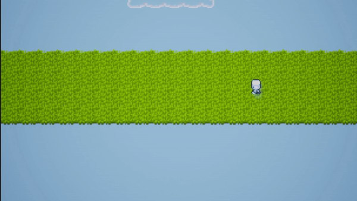

# Latest TTDEngine Patch-Notes

# Front End
- Changed Camera view to orthographic for improved RPG view
- Added Level Data Actor for managing Level transitions and Level Cameras
- Added Optional Static Camera (By default Camera follows player)
- Added Static Camera Actor for positioning of the Static camera when in use
- Updated Debug level Tilemaps to fit with default Static Camera
- Added Static Camera Actors to Debug Levels

  # Back End
  - Added Debug Full Bright Material (Mat_FullBright)
  - Added BP_LevelData
  - Added BP_StaticCam
 
## Static Camera Showcase:
 

